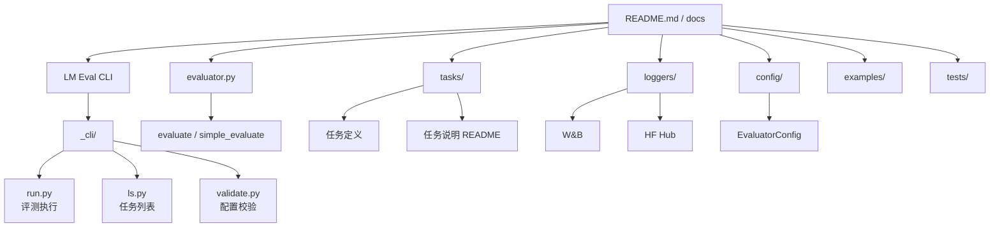
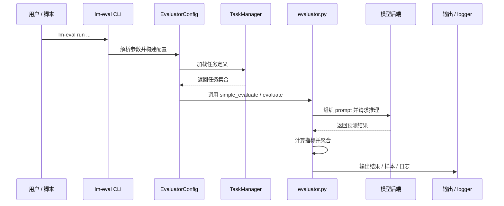
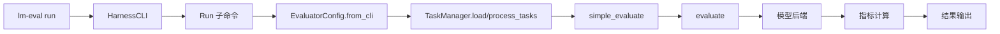
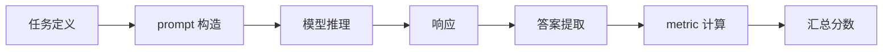

# lm-evaluation-harness 技术报告

## 摘要

`lm-evaluation-harness` 是 EleutherAI 维护的一个语言模型统一评测框架，核心目标是用一套标准化接口，对不同大语言模型在多类 benchmark 上进行可复现、可对比的评测。它支持 HuggingFace、vLLM 等多种推理后端，提供任务管理、few-shot 评测、结果汇总、样本导出、W&B/HF Hub 集成等能力，适合做模型基准测试、回归验证和横向对比。

## 1. 工程定位与核心能力

`lm-evaluation-harness` 的能力边界可以概括为四个层次：

1. **模型接入层**  
   - 通过统一的模型抽象接口接入不同推理后端。  
   - 支持 HuggingFace 模型、本地推理、部分服务化后端等。

2. **任务评测层**  
   - 以任务驱动方式组织 benchmark。  
   - 覆盖常识推理、阅读理解、数学、代码、知识问答、多语言等任务。

3. **评测执行层**  
   - 提供 CLI 和 Python API 两种入口。  
   - 支持 few-shot、zero-shot���batch、缓存、样本导出等评测选项。

4. **结果记录与扩展层**  
   - 可输出 JSON/表格结果。  
   - 支持 W&B、Hugging Face Hub 日志。  
   - 可通过外部目录扩展自定义任务。

## 2. 目录级架构视图



### 2.1 模块职责说明

| 目录 / 文件 | 主要职责 | 代表内容 |
|---|---|---|
| `lm_eval/_cli/` | 命令行入口与子命令 | `harness.py`、`run.py`、`ls.py` |
| `lm_eval/evaluator.py` | 执行评测与汇总结果 | `evaluate()`、`simple_evaluate()` |
| `lm_eval/tasks/` | benchmark 任务定义与配置 | 各数据集目录、README、group/task 定义 |
| `lm_eval/loggers/` | 结果记录、W&B、HF Hub 集成 | tracker、logger |
| `lm_eval/config/` | CLI 参数与配置管理 | `EvaluatorConfig` |
| `docs/` | 接口、配置、API 文档 | CLI Reference、Python API 等 |
| `examples/` | 示例 notebook / 使用示例 | overview notebook |
| `tests/` | 回归测试与校验 | 任务、评测、CLI 测试 |

## 3. 关键架构设计

### 3.1 CLI 驱动的统一入口

项目最核心的设计是把评测流程封装成统一 CLI：

- `lm-eval run ...`：执行评测  
- `lm-eval ls tasks`：列出任务  
- `lm-eval validate ...`：校验任务配置

从源码看，CLI 入口最终会进入：

- `lm_eval/__main__.py`  
- `lm_eval/_cli/harness.py`  
- `lm_eval/_cli/run.py`  

这意味着项目强调“可直接运行、参数化驱动”的工程风格，适合在研究场景和自动化流水线中使用。

### 3.2 任务驱动架构

`lm-evaluation-harness` 的评测不是硬编码在某个固定 benchmark 上，而是通过 `tasks/` 中的任务定义来组织。

每个任务通常描述：

- 数据集来源  
- prompt 构造方式  
- 答案提取方式  
- 指标计算方式  
- 组任务 / 子任务关系

这样做的好处是：

1. 新增任务不需要改评测主流程；  
2. 同一框架可覆盖大量 benchmark；  
3. 便于任务分组与统一统计。

### 3.3 模型抽象与后端兼容

虽然你提供的片段里主要展示的是 CLI 和 evaluator，但整个项目的设计目标很明确：通过模型抽象层兼容不同推理后端。

常见特征包括：

- 统一输入输出接口  
- 支持 HuggingFace 模型加载  
- 支持 chat template / few-shot prompt 格式化  
- 支持 generation 参数注入

这使得评测可以保持统一，而不必为不同模型重写评测逻辑。

### 3.4 结果记录与可追踪性

README 中明确提到：

- `--output_path`  
- `--log_samples`  
- `--wandb_args`  
- `--hf_hub_log_args`

说明项目不仅关注“跑分”，也关注：

- 结果可保存  
- 样本可审计  
- 评测可复现  
- 能接入实验追踪平台

## 4. 自动化评测流程

### 4.1 总体流程图



### 4.2 阶段拆解

#### 阶段一：解析命令行参数
入口在 `lm_eval/_cli/run.py`，会把 `--model`、`--tasks`、`--model_args`、`--num_fewshot` 等参数转换为内部配置对象。

#### 阶段二：加载任务
任务由 `TaskManager` 统一管理，支持：

- 单任务  
- 任务组  
- 子任务  
- 外部任务目录 `--include_path`

#### 阶段三：执行评测
核心评测逻辑在 `evaluator.py` 中，负责：

- 构建 prompt  
- 组装 few-shot 上下文  
- 发送请求到模型后端  
- 处理缓存  
- 汇总统计指标

#### 阶段四：结果输出
支持：

- 控制台表格输出  
- JSON 输出  
- 样本保存  
- W&B  
- Hugging Face Hub 记录

## 5. 数据流与调用链

### 5.1 CLI 到评测的调用链



### 5.2 任务系统的数据流



## 6. 关键文件与入口

建议按这个顺序理解项目：

1. `README.md`  
   - 项目简介、安装方式、快速开始  
2. `lm_eval/__main__.py`  
   - Python 模块入口  
3. `lm_eval/_cli/harness.py`  
   - CLI 总入口  
4. `lm_eval/_cli/run.py`  
   - 评测参数与执行逻辑  
5. `lm_eval/evaluator.py`  
   - 核心评测函数  
6. `lm_eval/tasks/README.md`  
   - 任务系统说明  
7. `docs/interface.md`  
   - CLI 详细说明  
8. `docs/python-api.md`  
   - Python API 使用方式  
9. `tests/`  
   - 看项目如何验证任务与评测流程

## 7. 安装与首次评测

### 7.1 安装

基础安装：

```bash
git clone https://github.com/EleutherAI/lm-evaluation-harness
cd lm-evaluation-harness
pip install -e .
```

如果你要跑特定任务，可能需要额外依赖，例如：

```bash
pip install -e "[math,ifeval,sentencepiece]"
```

### 7.2 查看可用任务

```bash
lm-eval ls tasks
```

### 7.3 跑第一个任务

最小示例：

```bash
lm-eval run --model hf --model_args pretrained=gpt2 --tasks hellaswag
```

建议首次跑时加上限制，先验证流程：

```bash
lm-eval run --model hf --model_args pretrained=gpt2 --tasks hellaswag --limit 10
```

### 7.4 一个更完整的示例

```bash
lm-eval run \
  --model hf \
  --model_args pretrained=gpt2,dtype=float32 \
  --tasks hellaswag \
  --device cpu \
  --batch_size 1 \
  --output_path output/hellaswag-test \
  --log_samples \
  --limit 10
```

## 8. 工程特点总结

`lm-evaluation-harness` 的特点可以概括为：

- **标准化**：统一 benchmark 评测口径  
- **模块化**：任务、模型、评测、日志清晰分层  
- **可扩展**：支持自定义任务和外部目录  
- **可追踪**：支持样本保存、结果输出和实验记录  
- **实用性强**：非常适合模型对比、回归测试、论文复现

## 9. 结论

从系统设计角度看，`lm-evaluation-harness` 是一个面向研究与工程实践的 LLM 统一评测底座。它不是单纯的脚本集合，而是把“模型接入、任务管理、评测执行、结果记录”完整串起来的框架。对于做模型对比、基准测试、任务扩展或评测自动化的团队来说，这个工程非常适合作为基础设施使用。

如果你愿意，我还可以继续帮你把这份报告再升级成更像正式技术文档的版本、加入更完整架构图，或者补充成适合新手入门的操作步骤版。