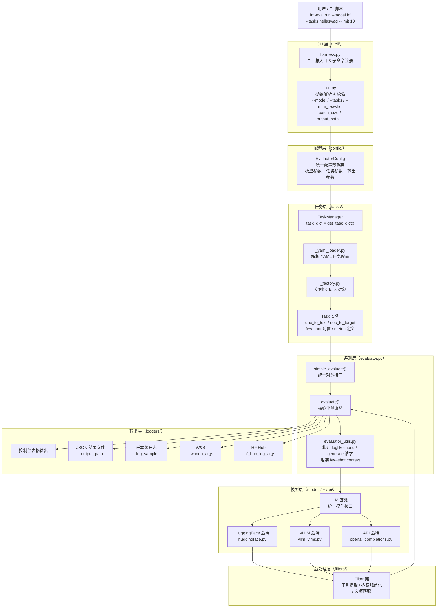
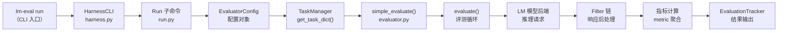
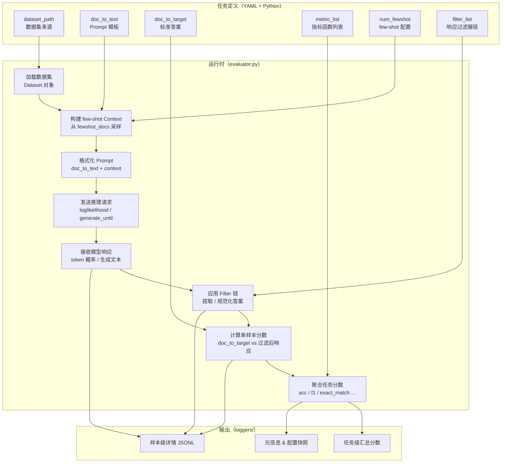
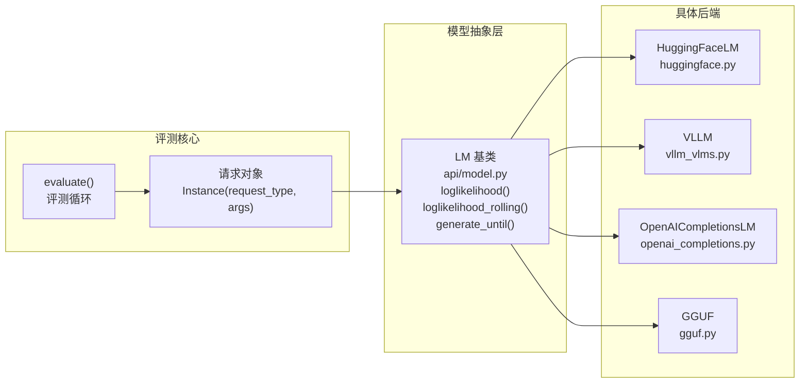

# lm-evaluation-harness 技术报告

## 摘要

`lm-evaluation-harness` 是 EleutherAI 维护的一个**语言模型统一评测框架**，核心目标是用一套标准化接口，对不同大语言模型在多类 benchmark 上进行可复现、可对比的评测。它支持 HuggingFace、vLLM 等多种推理后端，提供任务管理、few-shot 评测、结果汇总、样本导出、W&B/HF Hub 集成等能力，适合做模型基准测试、回归验证和横向对比。

---

## 1. 工程定位与核心能力

`lm-evaluation-harness` 的能力边界可以概括为四个层次：

1. **模型接入层**
   - 通过统一的模型抽象接口接入不同推理后端。
   - 支持 HuggingFace 模型、本地推理、vLLM、OpenAI API 等多种后端。

2. **任务评测层**
   - 以任务驱动方式组织 benchmark。
   - 覆盖常识推理、阅读理解、数学、代码、知识问答、多语言等 200+ 任务。

3. **评测执行层**
   - 提供 CLI 和 Python API 两种入口。
   - 支持 few-shot、zero-shot、batch、缓存、样本导出等评测选项。

4. **结果记录与扩展层**
   - 可输出 JSON/表格结果。
   - 支持 W&B、Hugging Face Hub 日志。
   - 可通过外部目录扩展自定义任务。

---

## 2. 目录级架构视图

```mermaid
graph TD
    ROOT["lm-evaluation-harness/\n（项目根目录）"]

    ROOT --> LMEVAL["lm_eval/\n核心源码包"]
    ROOT --> DOCS["docs/\n文档"]
    ROOT --> TESTS["tests/\n测试"]
    ROOT --> EXAMPLES["examples/\n示例 Notebook"]
    ROOT --> SCRIPTS["scripts/\n辅助脚本"]
    ROOT --> TEMPLATES["templates/\n任务模板"]

    LMEVAL --> MAIN["__main__.py\nPython 模块入口"]
    LMEVAL --> CLI["_cli/\nCLI 子命令系统"]
    LMEVAL --> EVALUATOR["evaluator.py\n核心评测逻辑"]
    LMEVAL --> EVALUATOR_UTILS["evaluator_utils.py\n评测工具函数"]
    LMEVAL --> TASKS["tasks/\n任务定义目录"]
    LMEVAL --> MODELS["models/\n模型后端适配"]
    LMEVAL --> CONFIG["config/\n配置管理"]
    LMEVAL --> LOGGERS["loggers/\n结果记录"]
    LMEVAL --> FILTERS["filters/\n响应过滤器"]
    LMEVAL --> CACHING["caching/\n推理缓存"]
    LMEVAL --> API["api/\n模型抽象接口"]
    LMEVAL --> PROMPTS["prompts/\nPrompt 管理"]

    CLI --> HARNESS["harness.py\nCLI 总入口"]
    CLI --> RUN["run.py\n评测执行子命令"]
    CLI --> LS["ls.py\n任务列表子命令"]
    CLI --> VALIDATE["validate.py\n配置校验子命令"]

    TASKS --> MANAGER["manager.py\nTaskManager"]
    TASKS --> YAML_LOADER["_yaml_loader.py\nYAML 任务加载器"]
    TASKS --> FACTORY["_factory.py\n任务工厂"]
    TASKS --> TASK_DIRS["hellaswag/ mmlu/ gsm8k/\n… 200+ 任务目录"]

    MODELS --> HF_MODEL["huggingface.py\nHF 后端"]
    MODELS --> VLLM_MODEL["vllm_vlms.py\nvLLM 后端"]
    MODELS --> API_MODEL["openai_completions.py\nAPI 后端"]

    LOGGERS --> EVAL_LOGGER["evaluation_tracker.py\n评测追踪器"]
    LOGGERS --> WB_LOGGER["wandb_logger.py\nW&B 日志"]
    LOGGERS --> HF_LOGGER["hf_logger.py\nHF Hub 日志"]

    CONFIG --> EVAL_CONFIG["EvaluatorConfig\n配置数据类"]
```



### 2.1 模块职责说明

| 目录 / 文件 | 主要职责 | 代表内容 |
|---|---|---|
| `lm_eval/__main__.py` | Python 模块入口，`python -m lm_eval` | 启动 CLI |
| `lm_eval/_cli/` | 命令行入口与子命令 | `harness.py`、`run.py`、`ls.py`、`validate.py` |
| `lm_eval/evaluator.py` | 执行评测与汇总结果 | `evaluate()`、`simple_evaluate()` |
| `lm_eval/evaluator_utils.py` | 评测辅助工具 | batch 构建、请求合并、结果聚合 |
| `lm_eval/tasks/` | benchmark 任务定义与配置 | `manager.py`、各数据集目录、YAML 配置 |
| `lm_eval/models/` | 模型后端适配层 | HuggingFace、vLLM、OpenAI、GGUF 等 |
| `lm_eval/api/` | 模型抽象接口定义 | `LM` 基类、请求类型定义 |
| `lm_eval/config/` | CLI 参数与配置管理 | `EvaluatorConfig` 数据类 |
| `lm_eval/loggers/` | 结果记录、W&B、HF Hub 集成 | `evaluation_tracker`、WandB、HF Hub |
| `lm_eval/filters/` | 模型响应过滤与后处理 | 正则提取、答案规范化 |
| `lm_eval/caching/` | 推理结果缓存 | 避免重复调用模型 |
| `lm_eval/prompts/` | Prompt 格式化与管理 | few-shot 模板、chat template |
| `docs/` | 接口、配置、API 文档 | `interface.md`、`python-api.md`、`task_guide.md` |
| `examples/` | 示例 notebook / 使用示例 | overview notebook |
| `tests/` | 回归测试与校验 | 任务、评测、CLI、模型测试 |

---

## 3. 关键架构设计

### 3.1 CLI 驱动的统一入口

项目最核心的设计是把评测流程封装成统一 CLI：

- `lm-eval run ...`：执行评测
- `lm-eval ls tasks`：列出任务
- `lm-eval validate ...`：校验任务配置

从源码看，CLI 入口最终会进入：

- `lm_eval/__main__.py`
- `lm_eval/_cli/harness.py`
- `lm_eval/_cli/run.py`

这意味着项目强调"**可直接运行、参数化驱动**"的工程风格，适合在研究场景和自动化流水线中使用。

### 3.2 任务驱动架构

`lm-evaluation-harness` 的评测不是硬编码在某个固定 benchmark 上，而是通过 `tasks/` 中的任务定义来组织。

每个任务通常描述：

- 数据集来源（HuggingFace Datasets 或本地）
- prompt 构造方式（doc_to_text / doc_to_target）
- 答案提取方式（filter 链）
- 指标计算方式（metric 函数）
- 组任务 / 子任务关系（group 继承）

这样做的好处是：

1. 新增任务不需要改评测主流程；
2. 同一框架可覆盖 200+ benchmark；
3. 便于任务分组与统一统计。

### 3.3 模型抽象与后端兼容

项目通过 `lm_eval/api/` 中的 `LM` 基类定义统一的模型接口，各后端在 `lm_eval/models/` 中实现：

- **HuggingFace**：直接加载 `transformers` 模型
- **vLLM**：高性能批量推理
- **OpenAI / Anthropic**：通过 API 调用
- **GGUF / llama.cpp**：本地量化模型

统一接口使评测逻辑与模型实现解耦，新增后端只需继承 `LM` 基类并实现对应方法。

### 3.4 结果记录与可追踪性

通过 `lm_eval/loggers/evaluation_tracker.py` 统一管理：

- `--output_path`：JSON 结果文件
- `--log_samples`：保存每条样本及模型响应
- `--wandb_args`：推送至 Weights & Biases
- `--hf_hub_log_args`：推送至 Hugging Face Hub

项目不仅关注"跑分"，也关注评测可复现性和样本级审计。

---

## 4. 自动化评测流程

### 4.1 CLI → 配置 → 任务加载 → 评测 → 输出 完整流程图



### 4.2 阶段拆解

#### 阶段一：解析命令行参数

入口在 `lm_eval/_cli/run.py`，会把以下参数解析并组装进 `EvaluatorConfig`：

| 参数 | 说明 |
|---|---|
| `--model` | 模型后端类型（hf / vllm / openai …） |
| `--model_args` | 模型初始化参数（pretrained / dtype / device_map …） |
| `--tasks` | 任务名称，支持逗号分隔或任务组 |
| `--num_fewshot` | few-shot 样本数量 |
| `--batch_size` | 推理 batch size |
| `--device` | 推理设备（cuda:0 / cpu …） |
| `--output_path` | 结果保存路径 |
| `--log_samples` | 是否保存样本级结果 |
| `--limit` | 每任务最多评测样本数（调试用） |
| `--include_path` | 外部自定义任务目录 |

#### 阶段二：加载任务

任务由 `TaskManager`（`tasks/manager.py`）统一管理：

1. `get_task_dict()` 解析任务名称，支持单任务、任务组、子任务；
2. `_yaml_loader.py` 读取对应目录下的 YAML 配置；
3. `_factory.py` 实例化具体的 `Task` 对象；
4. 支持通过 `--include_path` 加载外部自定义任务。

#### 阶段三：执行评测

核心评测逻辑在 `evaluator.py` 中：

1. `simple_evaluate()` 作为统一对外接口，也是 Python API 的入口；
2. `evaluate()` 实现核心评测循环：构建请求 → 调用模型 → 后处理 → 聚合指标；
3. `evaluator_utils.py` 负责 few-shot 上下文组装、batch 请求构建、指标聚合；
4. `caching/` 层缓存已完成的推理请求，支持断点续测。

#### 阶段四：结果输出

`loggers/evaluation_tracker.py` 统一管理输出：

- 控制台打印 Markdown 表格（任务名 / 指标名 / 分数 / stderr）
- `--output_path` 写入 JSON 结果文件（含元信息、配置、各任务分数）
- `--log_samples` 额外写入样本级 JSONL 文件
- `--wandb_args` 推送至 W&B 实验追踪
- `--hf_hub_log_args` 推送至 Hugging Face Hub

---

## 5. 数据流与调用链

### 5.1 CLI 到评测的调用链



### 5.2 任务系统数据流



### 5.3 模型抽象层调用关系



---

## 6. 关键文件与入口

建议按以下顺序理解项目：

| 优先级 | 文件 | 作用 |
|---|---|---|
| ★★★ | `README.md` | 项目简介、安装方式、快速开始 |
| ★★★ | `lm_eval/_cli/run.py` | CLI 参数定义与评测触发 |
| ★★★ | `lm_eval/evaluator.py` | 核心评测函数 `simple_evaluate` / `evaluate` |
| ★★★ | `lm_eval/tasks/manager.py` | 任务管理与加载逻辑 |
| ★★ | `lm_eval/__main__.py` | Python 模块入口 |
| ★★ | `lm_eval/_cli/harness.py` | CLI 总入口与子命令注册 |
| ★★ | `lm_eval/api/model.py` | 模型抽象基类 |
| ★★ | `lm_eval/tasks/_yaml_loader.py` | YAML 任务配置解析 |
| ★ | `docs/interface.md` | CLI 参数完整说明 |
| ★ | `docs/python-api.md` | Python API 使用方式 |
| ★ | `docs/new_task_guide.md` | 自定义任务接入指南 |
| ★ | `tests/` | 任务、评测、CLI、模型回归测试 |

---

## 7. 安装与首次评测

### 7.1 安装

基础安装：

```bash
git clone https://github.com/EleutherAI/lm-evaluation-harness
cd lm-evaluation-harness
pip install -e .
```

如果需要跑特定任务，补装对应扩展依赖：

```bash
# 数学评测（MATH benchmark）
pip install -e ".[math]"

# 指令跟随评测
pip install -e ".[ifeval]"

# 多语言任务（需要 sentencepiece）
pip install -e ".[sentencepiece]"

# 组合安装
pip install -e ".[math,ifeval,sentencepiece]"
```

常用可选 extras：

| extras | 用途 |
|---|---|
| `math` | MATH benchmark 数学评测 |
| `ifeval` | 指令跟随评测 |
| `sentencepiece` | 多语言 tokenizer |
| `multilingual` | 多语言任务扩展 |
| `vllm` | vLLM 推理后端 |
| `wandb` | W&B 日志集成 |
| `unitxt` | unitxt 任务集成 |
| `dev` | 开发工具（pytest、linter 等） |

### 7.2 查看可用任务

```bash
# 列出所有任务
lm-eval ls tasks

# 列出任务组
lm-eval ls groups

# 列出特定标签下的任务
lm-eval ls tasks --tag math
```

### 7.3 跑第一个任务

最小示例（CPU + GPT-2）：

```bash
lm-eval run --model hf --model_args pretrained=gpt2 --tasks hellaswag
```

首次建议加 `--limit` 先快速验证流程：

```bash
lm-eval run --model hf --model_args pretrained=gpt2 --tasks hellaswag --limit 10
```

### 7.4 一个更完整的示例

```bash
lm-eval run \
  --model hf \
  --model_args pretrained=gpt2,dtype=float32 \
  --tasks hellaswag,arc_easy \
  --num_fewshot 5 \
  --device cpu \
  --batch_size 4 \
  --output_path output/gpt2-test \
  --log_samples \
  --limit 50
```

### 7.5 使用 Python API

```python
from lm_eval import simple_evaluate

results = simple_evaluate(
    model="hf",
    model_args="pretrained=gpt2",
    tasks=["hellaswag"],
    num_fewshot=0,
    limit=10,
)
print(results["results"])
```

---

## 8. 工程特点总结

`lm-evaluation-harness` 的特点可以概括为：

| 特点 | 说明 |
|---|---|
| **标准化** | 统一 benchmark 评测口径，减少评测口径不一致 |
| **模块化** | 任务、模型、评测、日志清晰分层，关注点分离 |
| **可扩展** | 支持自定义任务（YAML/Python）和外部目录 |
| **可追踪** | 支持样本保存、结果输出、W&B/HF Hub 实验记录 |
| **多后端** | 兼容 HuggingFace、vLLM、OpenAI 等多种推理后端 |
| **实用性强** | 适合模型对比、回归测试、论文复现、CI/CD 集成 |

---

## 9. 结论

从系统设计角度看，`lm-evaluation-harness` 是一个面向研究与工程实践的 **LLM 统一评测底座**。它不是单纯的脚本集合，而是把"模型接入、任务管理、评测执行、结果记录"完整串起来的框架，具备以下核心价值：

1. **降低评测门槛**：一条命令即可跑通 200+ benchmark，无需了解各数据集细节；
2. **保障结果可信**：样本级日志 + 配置快照 + 随机种子，确保评测可复现；
3. **适应不同规模**：从单机 CPU 调试到分布式 GPU 集群，通过参数调整即可适配；
4. **易于二次开发**：任务系统基于 YAML + Python 扩展，模型层基于统一抽象接口。

对于做模型对比、基准测试、任务扩展或评测自动化的团队来说，这个工程非常适合作为基础设施使用。
